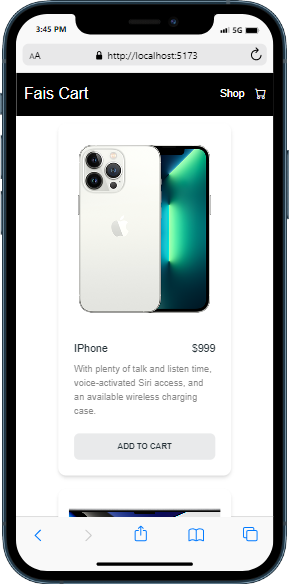

# Shopping Cart

This is a basic shopping cart web app in which user can add their product in cart and remove the product from cart 

## Table of contents

- [Overview](#overview)
  - [Screenshot](#screenshot)
  - [Links](#links)
- [My process](#my-process)
  - [Built with](#built-with)
  - [What I learned](#what-i-learned)

## Overview

### Screenshot

### Links

- GitHub Repo URL: [Basic Shopping Cart GitHub repo](https://github.com/faisgit/shopping-cart)

## My process

### Built with

- Semantic HTML5 markup
- CSS custom properties
- Flexbox
- CSS Grid
- Mobile-first workflow
- [React](https://react.dev/) - JS library
- [React Router Dom](https://www.npmjs.com/package/react-router-dom)
- [Tailwind CSS](https://tailwindcss.com/) - CSS Framework
- [Material Tailwind](https://www.material-tailwind.com/) - React framework

### What I learned

From this, Project How to use React Js and how to use ustate hook, context api, react router dom  . I also learn how to use Tailwind CSS in any Project with Material Tailwind
